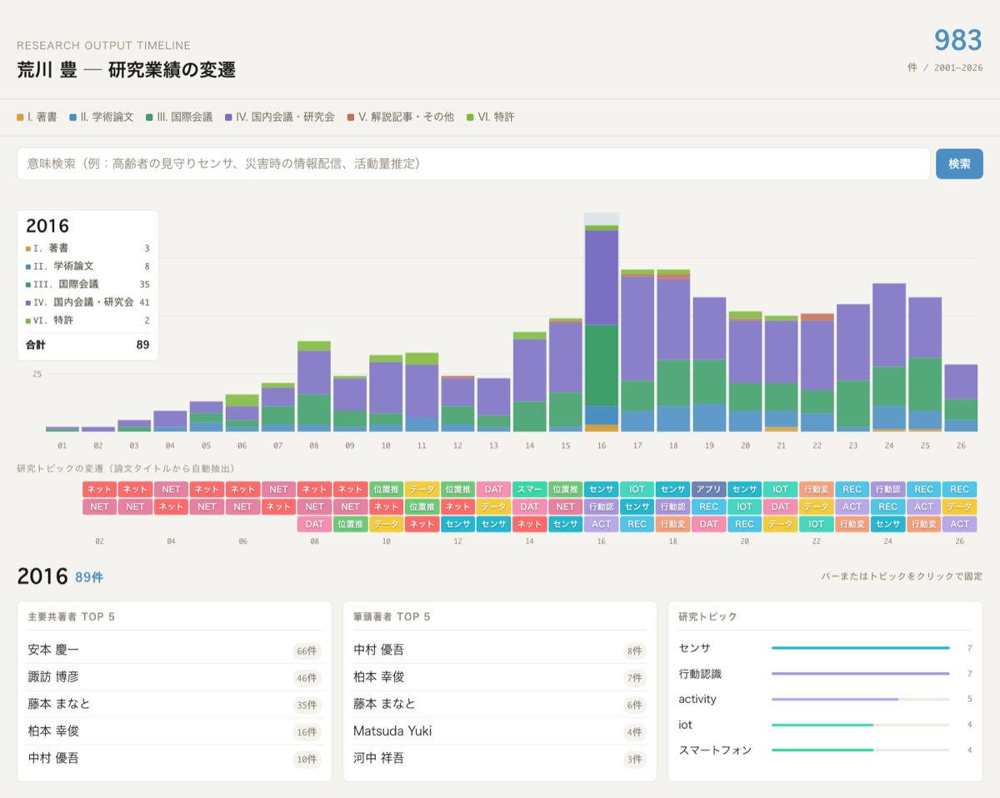
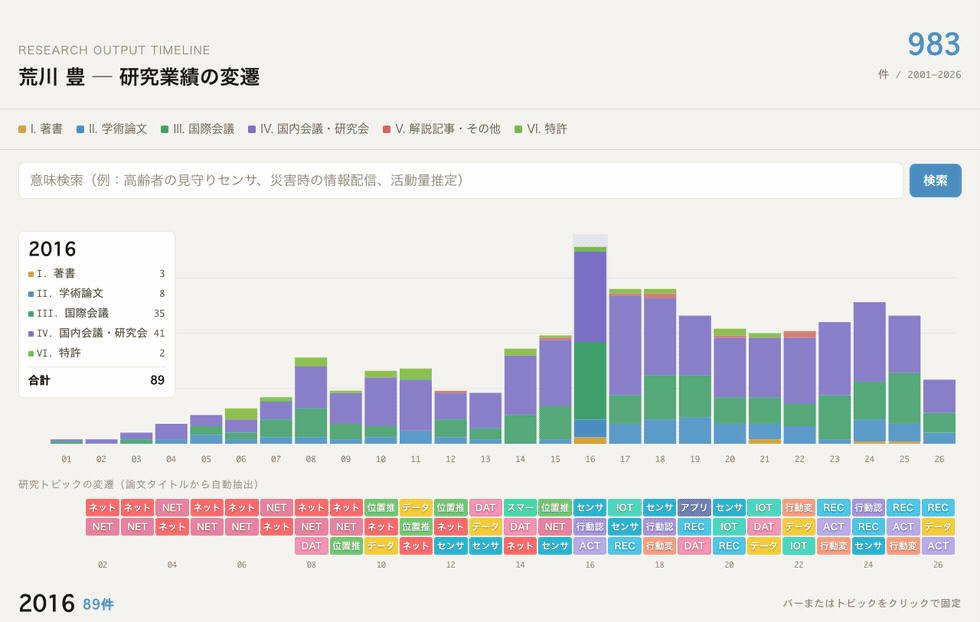
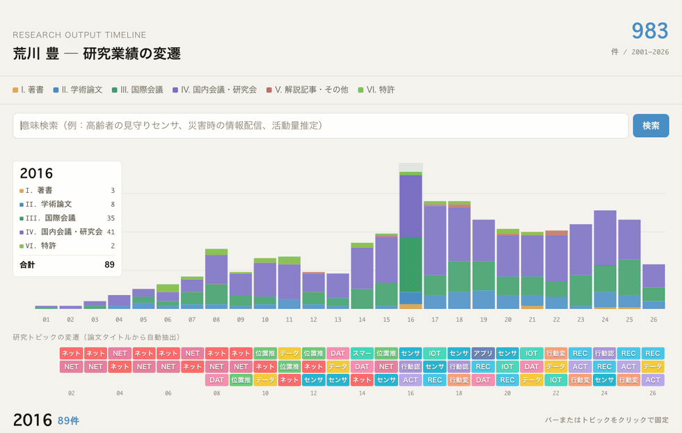
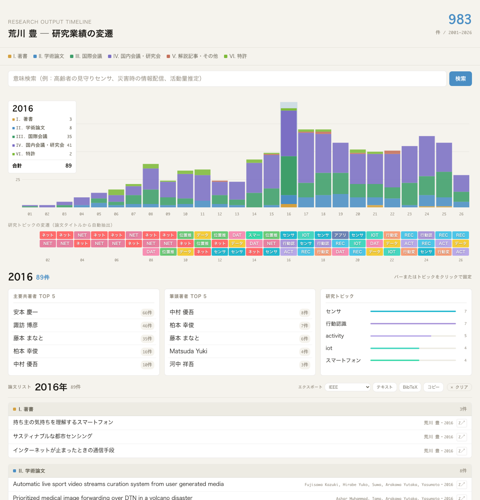
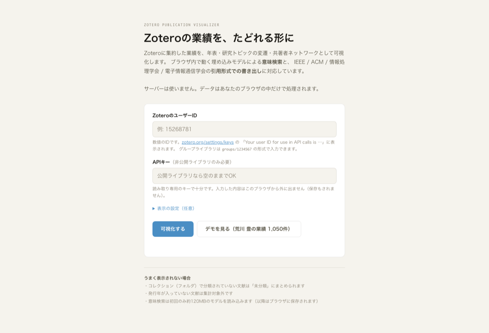

# Zotero Publication Visualizer

**Zoteroに集約した研究業績を、たどれる形にする。** ブラウザだけで動きます。サーバーもインストールも不要です。

🔗 **[デモを開く（荒川 豊の業績 1,050件）](https://wildriver.github.io/zotero-visualizer/?demo=1)** — 自分のZoteroユーザーIDを入れれば、そのまま自分の業績を可視化できます

<p align="center">
  
</p>

---

## これは何か

Zoteroを「文献管理」ではなく**自分の業績データベース**として使うと、こんなことができます。

- 25年分の業績を1枚で見渡し、研究の重心が移った時期を見つける
- 「この提案書に関係しそうな自分の論文」を意味で検索して拾い上げる
- 拾った論文を IEEE / ACM 形式で書き出し、そのまま原稿に貼る

このリポジトリには**2つの独立した部分**があります。

| | 内容 |
|---|---|
| **A. 可視化ツール** | `index.html` — Zoteroを読んで表示する。単一ファイル、依存なし |
| **B. 集約の手引き** | [docs/zotero-aggregation-guide.md](docs/zotero-aggregation-guide.md) — 各種ソースからZoteroへ業績を集める方法とTips |

Zoteroが空の状態から始める方は **B → A** の順に進んでください。
すでにZoteroに業績が入っている方は **A** だけで使えます。

---

## A. 可視化ツール

**サーバーもデータベースも使いません。** ブラウザがZotero APIを直接読み、集計も描画もその場で行います。
あなたの業績データが第三者のサーバーを経由することはありません。

### 触るとわかること

グラフの上をなぞると、下の3枚のカード（主要共著者・筆頭著者・研究トピック）が**その年の内容に入れ替わります**。
バーをクリックすると固定され、マウスを離しても表示が保たれます。
さらに**トピック名や共著者名をクリックすると、その条件で絞り込まれた業績一覧**が開きます。

<p align="center">
  
</p>

### 意味検索

キーワードが一致しなくても、**意味の近い論文**が見つかります。
「高齢者の見守りセンサ」で検索すると、この語を含まない
「デイケアセンターにおける高齢者の行動履歴自動生成」
「Elderly person monitoring in day care center」
が上位に出ます。和文で検索して欧文論文が見つかる、その逆も可能です。

多言語埋め込みモデル `multilingual-e5-small` を**ブラウザ内で**実行しているため、
検索語も論文情報も外部へ送られません。

> 文章を生成するLLM（WebLLMなど）ではなく、**文の意味をベクトルに変換して近さを測るだけ**のモデルです。
> そのため必要なのは約120MBで、数GBのLLMを読み込む必要はありません。

<p align="center">
  
</p>

初回は約120MBのモデル読み込みと全論文のベクトル化が走ります（1,000件で1〜2分）。
2回目以降はブラウザに保存されるため数秒です。

### 引用形式での書き出し

**IEEE / ACM / 情報処理学会 / 電子情報通信学会** の4形式に対応しています。
Wordにそのまま貼れるプレーンテキストで出力するので、Markdown記法やリンクは混ざりません。
BibTeX書き出しと、クリップボードへのコピーもできます。

<p align="center">
  
</p>

和文論文では著者名を日本語のまま、欧文スタイルでは `Y. Arakawa` のようにイニシャル表記へ自動変換します。

```
IEEE   Y. Arakawa, K. Yasumoto, K. Pattamasiriwat, and T. Mizumoto, "Improving recognition
       accuracy for activities of daily living...," in Proc. ICMU2017, 2017, pp. 1–6.
情処   Arakawa, Y., Yasumoto, K., Pattamasiriwat, K. and Mizumoto, T.: Improving recognition
       accuracy..., ICMU2017, pp.1–6 (2017).
```

### そのほか

- 年別・区分別の積み上げグラフ。バーをクリックするとその年の業績一覧が開く
- 研究トピックの変遷を論文タイトルから**自動抽出**（キーワード辞書の用意は不要）
- ライブラリの構成に自動で合わせる — コレクションをそのまま区分として使い、
  コレクションを使っていないライブラリでは文献の種類（学術論文・会議論文・特許…）で分類
- 各文献から Zotero を開くリンク
- ダークモード対応、スマートフォン表示対応

<p align="center">
  
  <em>年をクリックすると区分ごとに整理された一覧が開く</em>
</p>

### 使い方

**そのまま使う**

1. [デモページ](https://wildriver.github.io/zotero-visualizer/) を開く
2. ZoteroのユーザーID（数値）を入れる — [zotero.org/settings/keys](https://www.zotero.org/settings/keys) の
   「Your user ID for use in API calls is …」に表示されます
3. 非公開ライブラリの場合は**読み取り専用のAPIキー**も入れる（公開ライブラリなら不要）

入力内容はブラウザから外に出ません。APIキーは保存もされません。

<p align="center">
  
</p>

**自分で置く**

`index.html` 1ファイルだけをコピーすれば動きます。GitHub Pagesに置くのが手軽です。

```bash
git clone https://github.com/wildriver/zotero-visualizer.git
cd zotero-visualizer
python3 -m http.server 8123
# → http://localhost:8123/
```

> **`file://` で直接開くと意味検索が動きません。** 埋め込みモデルを読み込めないためです。
> グラフや引用出力は動きます。GitHub Pagesに置けばこの制約はなくなります。

**URLパラメータ**（共有リンク用）

| パラメータ | 例 | 動作 |
|---|---|---|
| `lib` | `?lib=users/15268781` | 指定ライブラリを直接開く |
| `year` | `?lib=...&year=2016` | その年の一覧を開いた状態にする |
| `q` | `?lib=...&q=行動変容` | 意味検索を実行した状態にする |
| `demo` | `?demo=1` | デモを開く |

### 知っておいてほしいこと

**和名と欧文表記は自動では同一人物と判定できません。** 「安本 慶一」と「Yasumoto Keiichi」は文字種が違うため機械的に結び付けられず、別々に集計されます。セットアップの「表示の設定」で対応を指定できます。

```
安本 慶一 = Yasumoto Keiichi
諏訪 博彦 = Suwa Hirohiko
```

実測では、この指定を4行入れるだけで、手作業で作った175人分の人名辞書とほぼ同じ集計結果になりました。
なお欧文の「姓 名」と「名 姓」の入れ替わり（`Yasumoto Keiichi` / `Keiichi YASUMOTO`）は自動で統合します。

**「筆頭著者 TOP 5」は学生の一覧ではありません。** 教員と学生の区別は人名辞書がないと判定できないため、筆頭著者の集計にしています。研究室の主宰者のライブラリであれば、実質的に学生の活躍が見える指標になります。

---

## B. 集約の手引き

📖 **[docs/zotero-aggregation-guide.md](docs/zotero-aggregation-guide.md)**

Zoteroが空の状態から業績を集約するための手引きです。**専用ツールは配っていません。**
生成AI（Claude Code / Codex など）との対話で、自分用のスクリプトを書く前提で書かれています。

理由は、ソースの持ち方（researchmap / Google Scholar / 手元のCV / 研究室HP）が人によって全く違い、
「この研究会発表を論文として数えるか」といった判断も分野や本人の方針で変わるため、
コードに固定できないからです。

**手引きに含まれるもの**

- **実際に踏んだ落とし穴** — `presentation` 型を使うと会議名が消える、`creatorType` が型ごとに違う、`inPublications` で意図せず公開される、バックアップをそのまま書き戻すと412になる
- **ソース別の取得方法** — researchmap / ORCID / OpenAlex / DBLP / Crossref はいずれも**APIキー不要**で叩けます。
  Google Scholar は公式APIがなくスクレイピングも現実的でないため、BibTeX書き出しで受ける方法を書いています。

  > **どのソースが効くかは人によって全く違います。** 手引きには参考として著者1人分の実測値を載せていますが、
  > それは researchmap を長年更新してきた・手元にCVがあった、という個別の事情による数字です。
  > ご自身の場合は、まず各ソースから何件取れるか数えてみるところから始めてください。
- Zotero API の要点（コレクション作成、50件バッチ投入、`version` と 412、レート制限）
- 名寄せ・重複排除の現実的な進め方
- **AIへの具体的な指示文例**（そのまま使える）
- 投入後の健全性チェック用スクリプト

### 参考実装

| ファイル | 用途 |
|---|---|
| `fetch_zotero.py` | Zoteroから全件取得（公開ライブラリならキー不要） |
| `analyze_viz5.py` | 集計・重複排除・トピック抽出。**人名辞書175人分を含む**ので使う方は書き換えてください |
| `pub_timeline.html` | データ埋め込み版の可視化（`index.html` の元。オフラインで配布したい場合向け） |

---

## APIキーについて

| 操作 | キー |
|---|---|
| Zoteroへの**登録・修正** | **必須**（書き込み権限） |
| Zoteroの**読み取り** | 公開ライブラリなら不要 |
| researchmap / ORCID / OpenAlex / DBLP / Crossref | すべて不要 |

キーはコードに直書きせず環境変数で渡してください。

```bash
export ZOTERO_API_KEY=xxxxx
export ZOTERO_USER_ID=1234567
```

> Zoteroの「My Publications」に入れたアイテム（`inPublications: true`）は**APIキー無しで誰でも読めます**。
> 一括登録時に意図せずそうなることがあります。一度キー無しでアクセスして確認してください。

---

## ライセンス

MIT

このツールと手引きは、著者1人が1,050件の業績をZoteroへ集約した経験から作られています。
手引きに出てくる件数はその1例の実測値で、一般的な目安ではありません。
